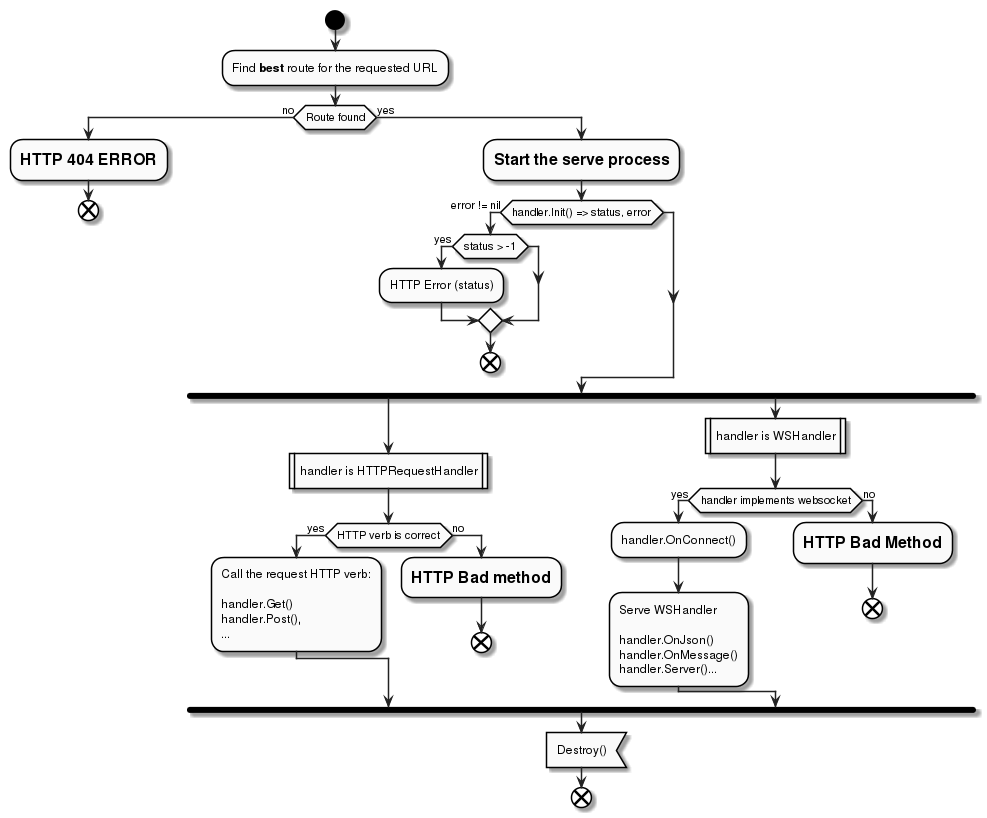

Developping with Kwiscale
=========================

Behind the scene
----------------

kwiscale is a web framework that uses
`GorillaToolkit <http://www.gorillatoolkit.org/>`__. The main purpose is
to allow developers to create handlers that serve reponses.

There are two Handlers types:

-  RequestHandler to respond to HTTP requests (Get, Post, Put, Delete,
   Patch, Trace, Head)
-  WebSocketHandler to serve websocket connection to client

Kwiscale proposes addon system to be able to plug template engines and
session engines. By default you may be able to use the standard
html/template package provided by Go and session by encrypted cookies
provided by GorillaToolkit.

Project Structure
-----------------

Recommandation is not obligation
~~~~~~~~~~~~~~~~~~~~~~~~~~~~~~~~

The common structure we give here is not mandatory. You can prefer other
file structure and project managment.

The standard Kwiscale structure
~~~~~~~~~~~~~~~~~~~~~~~~~~~~~~~

In a common usage, the following file structure is recommanded:

::

    [projectpath]/
        main.go
        handlers/
            index.go
            [other name].go
            ...
        templates/
            index.html
            - common/
                footer.html
                header.html
                menu.html
            - home/
                main.go
        statics/
            - js/
                ...
            - css/
                ...

Note that "handlers" directory may contains subpackages. The goal is to
classify HTTP handlers in the same directory. An example:

::

    handlers/
        index.go
        user/
            auth.go
            register.go
            profile-edition.go
        cms/
            page.go
            edit.go
        blog/
            index.go
            ticket.go

Handler story
-------------

When an user calls a route, Kwiscale will find the corresponding handler
in a stack. When a route matches, kwiscale app detect handler type and
call a serie of methods (see :ref:`handler-process`)

.. _handler-process:

   Handler story diagram

Serve static files
------------------

**Important** The static handler provided by kwiscale is provided for
development and **not for the production**. It's not recommanded to let
Kwiscale serve directoy web application, you'd rather use HTTP Server as
nginx or Apache as reverse proxy. That way, the HTTP server will serve
static files instead of using static handler provided by Kwiscale.

To serve static files (css, js, images, and so on) you may configure
Kwiscale.App like this:

.. code-block:: go

    cfg := kwiscale.Config{
        StaticDir: "./statics",
    }
    app := kwiscale.NewApp(&cfg)

Kwiscale uses the directory name to serve files that resides inside. You
can now hit URL http://127.0.0.1:8000/statics/...

Note that static handler doesn't make directory index. Hitting the
static route without any filename will result on 404 Error.

URL Routing
-----------

Kwiscale make use of GorillaToolkit route system. This routing
implementation allows you to set url parameters and to reverse an url
from a handler name.

Example:

.. code-block:: go

    type MyHandler struct { kwiscale.RequestHandler }

    func (h *UserHandler) Get(){
        userid := h.Vars["userid"]
    }

    func main(){
        //...
     
        // Add a route that need an user id named "userid".
        // Route parameters are regular expression.
        app.AddRoute("/user/{userid:\d+}", UserHandler{})

        //...
    }

The corresponding route could be "/user/123456", then in ``Get()``,
``userid`` contains a string value: "123456".

To reverse an url, you need the name of the handler. The "kwiscale.App"
can provide the named route and you may use ``URL`` to return the
corresponding URL. Here is an example:

.. code-block:: go

    // Route /user/{userid:\d+}
    url := myhandler.GetApp().GetRoute("main.UserHandler").URL("userid", "123456")

    // If myhandler is the wanted handler
    url := myhandler.GetURL("userid", "123456")

Named route
-----------

If you want to not use handler name based on reflected value, you may
use ``AddNamedRoute()`` instead:

.. code-block:: go

    app.AddNamedRoute("/user/{userid:\d+}", UserHandler{}, "users")

So, to reverse URL:

.. code-block:: go

    // Route /user/{userid:\d+}
    url := myhandler.GetApp().GetRoute("users").URL("userid", "123456")
